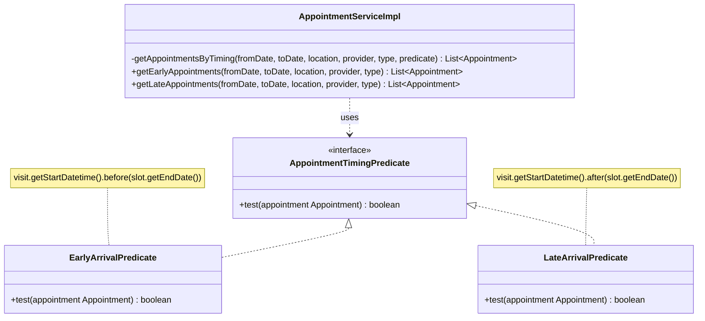
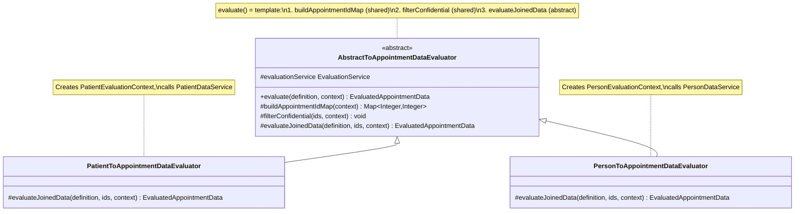
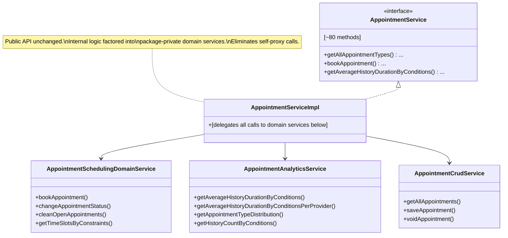
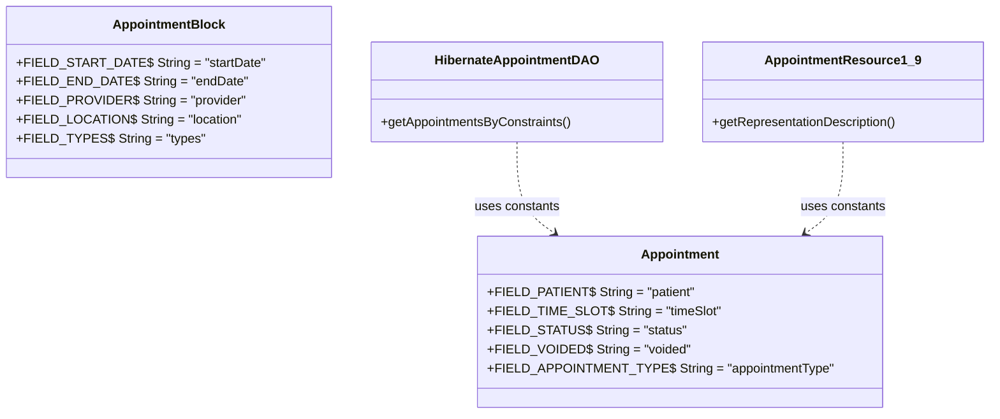

# Maintainability Analysis — Appointment Scheduling Module

---

## 1. SonarQube Findings Summary

| Metric | Value | Context |
|---|---|---|
| Code Smells | **523** | Dashboard total |
| Technical Debt | **5,306 min (~88 h)** | sqale_index |
| Bugs | 14 | reliability |
| Vulnerabilities | 2 | (security — excluded from this report) |
| Duplicated Lines | 554 (4.2%) | across 42 duplicated blocks |
| Cognitive Complexity | 1,080 | total; worst single method = 37 |
| Cyclomatic Complexity | 1,346 | total |
| Lines of Code | 8,356 | non-comment |

**Top SonarQube rule violations (maintainability):**

| Rule | Count | Description |
|---|---|---|
| `java:S1192` | ~49 instances | String literals repeated 3+ times — no constant defined |
| `java:S3776` | 5 methods | Cognitive complexity exceeds threshold of 15 |
| `java:S6809` | 3 sites | Transactional methods called via `this` instead of injected proxy |
| `java:S1948` | 3 fields | Non-serializable fields in `Appointment` class |
| `java:S8346` | 2 instances | `++` on `float`/`double` in `StudentT` |

---

## 2. Code Duplication Analysis

### 2a. Structural clones — highest value targets

**`AppointmentServiceImpl.java:1008–1137` — Two 65-line near-identical analytics methods**

`getAverageHistoryDurationByConditions` (groups by `AppointmentType`) and `getAverageHistoryDurationByConditionsPerProvider` (groups by `Provider`) share ~95% of code:

- Identical: fetch histories, build duration map, sqrt-transform, compute confidence interval, accumulate sum/count per key, compute average
- Differs only in: the key type (`AppointmentType` vs `Provider`) and how the key is extracted from history

This is the highest-priority duplication in the codebase.

**`PatientToAppointmentDataEvaluator.java` vs `PersonToAppointmentDataEvaluator.java` — 80% identical files**

Both files:
- Build the identical HQL for `appointmentId → patientId` mapping (lines 36–48 identical)
- Apply identical confidentiality-filtering logic (lines 50–70 identical)
- Differ only in: the evaluation context type and which downstream data service is called

**`AppointmentServiceImpl.java:1314–1348` — `getEarlyAppointments` vs `getLateAppointments`**

Both methods: query completed/in-consultation appointments by constraints, iterate, and filter. The only difference is the predicate: `.before(slot.getEndDate())` vs `.after(slot.getEndDate())`.

### 2b. String literal duplication across DAO and REST layers

SonarQube flagged 49 `S1192` violations. The worst offenders:

| Location | Duplicated literals |
|---|---|
| `HibernateAppointmentDAO.java` | `"patient"` ×4, `"timeSlot"` ×4, `"status"` ×3, `"voided"` ×3 |
| `HibernateAppointmentBlockDAO.java` | `"startDate"` ×5, `"endDate"` ×3 |
| `HibernateProviderScheduleDAO.java` | `"HH:mm:ss"` ×4 |
| `AppointmentResource1_9.java` | `"visit"` ×6, `"patient"` ×5, `"status"` ×5, `"appointmentType"` ×5 |
| `AppointmentRequestResource1_9.java` | `"patient"` ×6, `"provider"` ×6, `"appointmentType"` ×6, `"status"` ×6, plus 8 more |

---

## 3. Coupling Analysis

### 3a. God Class — `AppointmentServiceImpl` (1,433 lines, 7 injected DAOs)

`AppointmentServiceImpl` is responsible for:

1. CRUD for 6 domain entities: `AppointmentType`, `AppointmentBlock`, `TimeSlot`, `Appointment`, `AppointmentStatusHistory`, `AppointmentRequest`, `ProviderSchedule`
2. Booking logic (`bookAppointment`, `cleanOpenAppointments`, `changeAppointmentStatus`)
3. Availability computation (`getTimeSlotsByConstraints*`, `getAllLocationDescendants`)
4. Analytics (`getAverageHistoryDurationBy*`, `getHistoryCountByConditions`, `getAppointmentTypeDistribution`)
5. Statistical outlier detection (`confidenceInterval` + `StudentT`)
6. Provider/patient utility helpers (`getAllProvidersSorted`, `getPatientIdentifiersRepresentation`)

This produces maximum afferent coupling — every other component in the module talks to `AppointmentServiceImpl`. Changes to any single domain entity risk rippling across the entire class.

### 3b. Self-injection anti-pattern (S6809)

At `AppointmentServiceImpl.java:307–310`, line 741, and line 1196:

```java
Context.getService(AppointmentService.class).voidTimeSlot(...)
Context.getService(AppointmentService.class).getAppointmentsInTimeSlotThatAreNotCancelled(...)
Context.getService(AppointmentService.class).saveAppointment(...)
```

The class must call itself via the Spring context proxy to activate `@Transactional` interceptors. This is a structural symptom of the god class: methods that would naturally belong to separate services instead need transactional plumbing through a shared proxy.

### 3c. Validator–Service coupling

`AppointmentBlockValidator.java:68` calls `Context.getService(AppointmentService.class)` directly inside `validate()`. Validators should be stateless and depend only on the object being validated; pulling business logic into them creates a dependency cycle risk and makes them harder to unit-test in isolation.

### 3d. Web layer bypassing DI

`DWRAppointmentService.java` uses `Context.getService()` rather than Spring injection for every call. While this is an OpenMRS convention for DWR classes, it makes the coupling invisible to the DI container and unverifiable at startup.

### 3e. Deprecated `Date` constructor at service layer

`AppointmentServiceImpl.java:1307–1310` uses the deprecated `new Date(year, month, date, hrs, min, sec)` constructor. This is a coupling to a removed API surface that will eventually break.

---

## 4. Design Pattern Recommendations with UML

### 4a. Template Method — eliminate the two duplicate analytics methods (Priority: HIGH)

The `getAverageHistoryDurationByConditions` and `getAverageHistoryDurationByConditionsPerProvider` pair is textbook Template Method: a fixed algorithm with one variable step.


**Refactoring target** — the private template method signature:

```java
private <K> Map<K, Double> computeAverageDurations(
    Date fromDate, Date endDate, AppointmentStatus status,
    Function<AppointmentStatusHistory, K> keyExtractor)
```

Both public methods become one-liners delegating with the appropriate lambda.

---

### 4b. Strategy Pattern — `getEarlyAppointments` / `getLateAppointments` (Priority: MEDIUM)



Since Java 8+ lambdas are available, `AppointmentTimingPredicate` can simply be `Predicate<Appointment>`.

---

### 4c. Abstract Base Class — duplicate evaluators (Priority: MEDIUM)

`PatientToAppointmentDataEvaluator` and `PersonToAppointmentDataEvaluator` share a 60-line common body with only 10 lines differing.



---

### 4d. Facade Pattern — decompose the God Class (Priority: HIGH, long-term)

The `AppointmentService` interface is a public API with ~80 methods, so it cannot be split directly. The recommended approach is to extract internal *domain delegates* while keeping `AppointmentServiceImpl` as a thin facade:



This resolves the S6809 self-proxy issues: `AppointmentSchedulingDomainService.bookAppointment()` would call `AppointmentCrudService.saveAppointment()` via injection — no `Context.getService()` needed.

---

### 4e. Constants extraction — DAO/REST field name literals (Priority: LOW, high volume)

Each domain class should own its Hibernate field name constants:



This resolves all 49 `S1192` violations in one sweep and prevents divergence if a field is ever renamed.

---

## 5. Prioritized Improvement Recommendations

| Priority | Issue | Files | Effort | Impact |
|---|---|---|---|---|
| **P1** | Extract template method for duplicate analytics methods | `AppointmentServiceImpl.java:1008–1137` | Low | Removes ~65 lines of cloned logic; cognitive complexity ↓ |
| **P1** | Define field name constants in domain classes | `Appointment`, `AppointmentBlock`, all Hibernate DAOs, all REST resources | Low | Resolves ~49 S1192 violations at once |
| **P2** | Extract shared base class for evaluators | `PatientToAppointmentDataEvaluator.java`, `PersonToAppointmentDataEvaluator.java` | Low | Eliminates ~60 lines of duplicated HQL + confidentiality logic |
| **P2** | Strategy-extract `getEarlyAppointments`/`getLateAppointments` | `AppointmentServiceImpl.java:1314–1348` | Low | 35 lines → ~12 lines |
| **P2** | Replace deprecated `new Date(int,int,int,int,int,int)` with `Calendar`-based `setupDate` (already exists in same file) | `AppointmentServiceImpl.java:1307` | Trivial | Removes a bug-flagged deprecated API call |
| **P3** | Reduce `AppointmentBlockValidator` complexity (S3776: cognitive 20) | `AppointmentBlockValidator.java:59` | Low | Extract type-validation loop to private method |
| **P3** | Reduce `HibernateAppointmentDAO.getAppointmentsByConstraints` complexity (cognitive 37) | `HibernateAppointmentDAO.java` | Medium | Extract each filter branch to private method |
| **P4** | Facade decomposition of `AppointmentServiceImpl` | `AppointmentServiceImpl.java` | High | Resolves self-proxy anti-pattern (S6809), reduces god-class complexity; public API unchanged |
