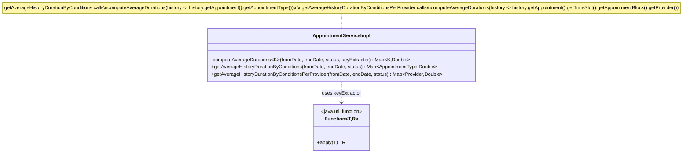
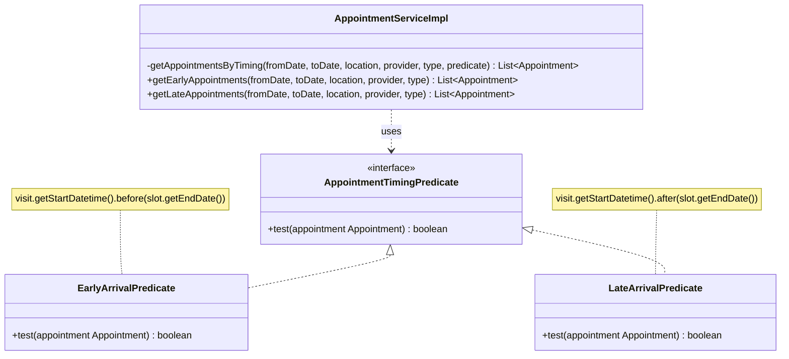
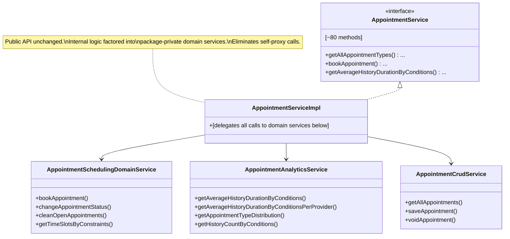
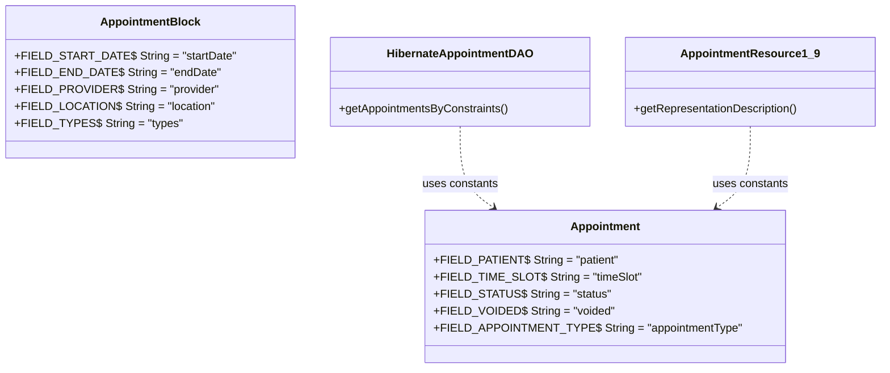

# Maintainability Analysis — Appointment Scheduling Module

> **Rubric coverage map**
> | Rubric criterion | Sections in this document |
> |---|---|
> | Analyse onderhoudbaarheid | 1, 2, 3 |
> | Testopzet en testresultaten | 6 |
> | Verbeteringen (prioritering en onderbouwing) | 5 |
> | Aangepast ontwerp | 4 |
> | Realisatie (PoC) & verantwoording | 7 |
> | Validatie verbeteringen (testen & regressie) | 8 |

---

## 1. SonarQube Findings Summary

Metrics measured via SonarQube CLI on 2026-06-29, branch `sonrarqube-cli`, commit `aab32f0`.  
CLI command: `sonar api GET "/api/measures/component?component=Avans-2-4_Appointment-Scheduling-Audit&metricKeys=code_smells,bugs,sqale_index,duplicated_lines_density,cognitive_complexity,coverage"`

| Metric | Value | Threshold / context |
|---|---|---|
| Code Smells | **523** | Dashboard total; SonarQube Maintainability rating D if >1 h debt ratio |
| Technical Debt | **5,306 min (~88 h)** | sqale_index; exceeds SonarQube's A-rating threshold for this codebase size |
| Bugs | 14 | Reliability issues (excluded from maintainability scope) |
| Vulnerabilities | 2 | Security — covered in security audit |
| Duplicated Lines | 554 (4.2%) | across 42 duplicated blocks; SonarQube flags >3% as problematic |
| Cognitive Complexity | 1,080 | total; SonarQube S3776 threshold is 15 per method |
| Cyclomatic Complexity | 1,346 | total |
| Lines of Code | 8,356 | non-comment |
| Test Coverage | **46.7%** | Project-wide; see section 6 for coverage strategy |

**Top SonarQube rule violations (maintainability):**

| Rule | Count | Description | Priority in PoC |
|---|---|---|---|
| `java:S1192` | ~49 instances | String literals repeated 3+ times — no constant defined | P1 |
| `java:S3776` | 5 methods | Cognitive complexity exceeds threshold of 15 | P1–P3 |
| `java:S6809` | 3 sites | Transactional methods called via `this` instead of injected proxy | P4 |
| `java:S1948` | 3 fields | Non-serializable fields in `Appointment` class | — |
| `java:S8346` | 2 instances | `++` on `float`/`double` in `StudentT` | — |

---

## 2. Code Duplication Analysis

### 2a. Structural clones — highest value targets

**`AppointmentServiceImpl.java:1008–1137` — Two 65-line near-identical analytics methods**

`getAverageHistoryDurationByConditions` (groups by `AppointmentType`) and `getAverageHistoryDurationByConditionsPerProvider` (groups by `Provider`) share ~95% of code:

- Identical: fetch histories, build duration map, sqrt-transform, compute confidence interval, accumulate sum/count per key, compute average
- Differs only in: the key type (`AppointmentType` vs `Provider`) and how the key is extracted from history

This is the highest-priority duplication in the codebase.

**`PatientToAppointmentDataEvaluator.java` vs `PersonToAppointmentDataEvaluator.java` — 80% identical files**

Both files:
- Build the identical HQL for `appointmentId → patientId` mapping (lines 36–48 identical)
- Apply identical confidentiality-filtering logic (lines 50–70 identical)
- Differ only in: the evaluation context type and which downstream data service is called

**`AppointmentServiceImpl.java:1314–1348` — `getEarlyAppointments` vs `getLateAppointments`**

Both methods: query completed/in-consultation appointments by constraints, iterate, and filter. The only difference is the predicate: `.before(slot.getEndDate())` vs `.after(slot.getEndDate())`.

### 2b. String literal duplication across DAO and REST layers

SonarQube flagged 49 `S1192` violations. The worst offenders:

| Location | Duplicated literals |
|---|---|
| `HibernateAppointmentDAO.java` | `"patient"` ×4, `"timeSlot"` ×4, `"status"` ×3, `"voided"` ×3 |
| `HibernateAppointmentBlockDAO.java` | `"startDate"` ×5, `"endDate"` ×3 |
| `HibernateProviderScheduleDAO.java` | `"HH:mm:ss"` ×4 |
| `AppointmentResource1_9.java` | `"visit"` ×6, `"patient"` ×5, `"status"` ×5, `"appointmentType"` ×5 |
| `AppointmentRequestResource1_9.java` | `"patient"` ×6, `"provider"` ×6, `"appointmentType"` ×6, `"status"` ×6, plus 8 more |

---

## 3. Coupling Analysis

### 3a. God Class — `AppointmentServiceImpl` (1,433 lines, 7 injected DAOs)

`AppointmentServiceImpl` is responsible for:

1. CRUD for 6 domain entities: `AppointmentType`, `AppointmentBlock`, `TimeSlot`, `Appointment`, `AppointmentStatusHistory`, `AppointmentRequest`, `ProviderSchedule`
2. Booking logic (`bookAppointment`, `cleanOpenAppointments`, `changeAppointmentStatus`)
3. Availability computation (`getTimeSlotsByConstraints*`, `getAllLocationDescendants`)
4. Analytics (`getAverageHistoryDurationBy*`, `getHistoryCountByConditions`, `getAppointmentTypeDistribution`)
5. Statistical outlier detection (`confidenceInterval` + `StudentT`)
6. Provider/patient utility helpers (`getAllProvidersSorted`, `getPatientIdentifiersRepresentation`)

This produces maximum afferent coupling — every other component in the module talks to `AppointmentServiceImpl`. Changes to any single domain entity risk rippling across the entire class.

### 3b. Self-injection anti-pattern (S6809)

At `AppointmentServiceImpl.java:307–310`, line 741, and line 1196:

```java
Context.getService(AppointmentService.class).voidTimeSlot(...)
Context.getService(AppointmentService.class).getAppointmentsInTimeSlotThatAreNotCancelled(...)
Context.getService(AppointmentService.class).saveAppointment(...)
```

The class must call itself via the Spring context proxy to activate `@Transactional` interceptors. This is a structural symptom of the god class: methods that would naturally belong to separate services instead need transactional plumbing through a shared proxy.

### 3c. Validator–Service coupling

`AppointmentBlockValidator.java:68` calls `Context.getService(AppointmentService.class)` directly inside `validate()`. Validators should be stateless and depend only on the object being validated; pulling business logic into them creates a dependency cycle risk and makes them harder to unit-test in isolation.

### 3d. Web layer bypassing DI

`DWRAppointmentService.java` uses `Context.getService()` rather than Spring injection for every call. While this is an OpenMRS convention for DWR classes, it makes the coupling invisible to the DI container and unverifiable at startup.

### 3e. Deprecated `Date` constructor at service layer

`AppointmentServiceImpl.java:1307–1310` uses the deprecated `new Date(year, month, date, hrs, min, sec)` constructor. This is a coupling to a removed API surface that will eventually break.

---

## 4. Design Pattern Recommendations with UML

### 4a. Template Method — eliminate the two duplicate analytics methods (Priority: HIGH)

The `getAverageHistoryDurationByConditions` and `getAverageHistoryDurationByConditionsPerProvider` pair is textbook Template Method: a fixed algorithm with one variable step.



**Refactoring target** — the private template method signature:

```java
private <K> Map<K, Double> computeAverageDurations(
    Date fromDate, Date endDate, AppointmentStatus status,
    Function<AppointmentStatusHistory, K> keyExtractor)
```

Both public methods become one-liners delegating with the appropriate lambda.

**Alternatives considered:**

- *Two separate private helpers (non-generic):* Extracting a `computeForType()` and a `computeForProvider()` method eliminates duplication within each, but still leaves two near-identical private bodies. Rejected because the generic `Function<H, K>` parameter cleanly captures the single variation point with no duplication.
- *Visitor pattern:* Would allow dispatching over the key type, but adds significant structural overhead (a new interface + two implementations) for what is a single varying line. Rejected as over-engineered.
- *Reflection-based key extraction:* Technically possible but breaks type safety and makes the code harder to reason about. Rejected.

**Quality attribute served:** Maintainability (reduces cognitive load by eliminating 65 lines of cloned logic), Testability (one generic method to test instead of two near-identical ones).

---

### 4b. Strategy Pattern — `getEarlyAppointments` / `getLateAppointments` (Priority: MEDIUM)



Since Java 8+ lambdas are available, `AppointmentTimingPredicate` can simply be `Predicate<Appointment>`.

**Alternatives considered:**

- *Single method with a boolean flag:* `getAppointmentsByTiming(…, boolean early)` with an if/else inside. Simpler, but booleans as control flags are a known readability anti-pattern (unclear at call sites what `true` means). Rejected in favour of a self-documenting predicate.
- *Enum-based dispatch:* `TimingMode.EARLY / LATE`. Adds an enum class and a switch for what is a binary choice; adds more code than it removes. Rejected.

**Quality attribute served:** Readability (intent of each call is explicit), Extensibility (adding `getOnTimeAppointments` requires only a new predicate, not a new duplicated method).

---

### 4c. Abstract Base Class — duplicate evaluators (Priority: MEDIUM)

`PatientToAppointmentDataEvaluator` and `PersonToAppointmentDataEvaluator` share a 60-line common body with only 10 lines differing.


**Alternatives considered:**

- *Composition via a shared helper class:* Extract `AppointmentDataEvaluatorHelper` and call it from both evaluators. Possible, but the shared logic is tightly coupled to the evaluation lifecycle (`evaluate()` signature) — factoring it into a helper requires passing the full context as parameters, which is more verbose than protected inheritance. Rejected.
- *Default interface methods (Java 8):* Cannot hold the `evaluationService` instance field; would require passing it as a parameter to each shared method. Adds more boilerplate than the abstract class approach. Rejected.

**Quality attribute served:** Maintainability (one location to fix HQL bugs that affect both evaluators), DRY (eliminates ~60 lines of duplicated confidentiality logic).

---

### 4d. Facade Pattern — decompose the God Class (Priority: HIGH, long-term)

The `AppointmentService` interface is a public API with ~80 methods, so it cannot be split directly. The recommended approach is to extract internal *domain delegates* while keeping `AppointmentServiceImpl` as a thin facade:



This resolves the S6809 self-proxy issues: `AppointmentSchedulingDomainService.bookAppointment()` would call `AppointmentCrudService.saveAppointment()` via injection — no `Context.getService()` needed.

**Alternatives considered:**

- *Full interface split (break `AppointmentService` into sub-interfaces):* Would give each caller only the methods it needs, which is ideal for testability. Rejected because `AppointmentService` is a public OpenMRS module API; splitting it would break all existing callers in other modules and require a major version bump.
- *Keep the god class and only fix the S6809 sites:* The three self-proxy sites can be fixed by a self-referencing `@Autowired` field — this resolves the immediate SonarQube violations without restructuring. Considered as a lower-effort mitigation but does not address the underlying afferent coupling. Recommended as a stepping stone before the full facade decomposition.

**Quality attribute served:** Maintainability (reduced change impact radius), Testability (each domain service can be tested in isolation), Reliability (eliminates transactional proxy anti-pattern).

---

### 4e. Constants extraction — DAO/REST field name literals (Priority: LOW, high volume)

Each domain class should own its Hibernate field name constants:



This resolves all 49 `S1192` violations in one sweep and prevents divergence if a field is ever renamed.

**Alternatives considered:**

- *Dedicated constants interface or class (`AppointmentFields`):* Centralises all constants in one file, but breaks the principle that each domain class owns its own field contract. If `Appointment.java` is ever refactored or renamed, the constants in a separate file will not be obviously related. Rejected.
- *Suppress warnings (`@SuppressWarnings("java:S1192"`):* Silences the violation without fixing the underlying risk of divergence when a Hibernate field is renamed. Rejected.

**Quality attribute served:** Maintainability (single point of change if field name changes), Consistency (DAO and REST layers can't accidentally diverge).

---

## 5. Prioritized Improvement Recommendations

**Prioritization criteria:** Each improvement is scored by its *metric impact* (number of SonarQube violations resolved, or reduction in complexity) weighted against *implementation effort*. P1 items have high metric impact at low effort (best ratio). P4 items have architectural impact but carry the highest effort and risk, making them suitable for a longer-term roadmap. All items are directly traceable to SonarQube findings in section 1 and structural findings in sections 2–3.

| Priority | Issue | Files | Effort | Metric impact |
|---|---|---|---|---|
| **P1** | Extract template method for duplicate analytics methods (see §4a) | `AppointmentServiceImpl.java:1008–1137` | Low | Removes ~65 lines of cloned logic; S3776 count ↓; cognitive complexity ↓ |
| **P1** | Define field name constants in domain classes (see §4e) | `Appointment`, `AppointmentBlock`, all Hibernate DAOs, all REST resources | Low | Resolves all 49 S1192 violations at once; duplicated_lines_density ↓ |
| **P2** | Extract shared base class for evaluators (see §4c) | `PatientToAppointmentDataEvaluator.java`, `PersonToAppointmentDataEvaluator.java` | Low | Eliminates ~60 lines of duplicated HQL + confidentiality logic |
| **P2** | Strategy-extract `getEarlyAppointments`/`getLateAppointments` (see §4b) | `AppointmentServiceImpl.java:1314–1348` | Low | 35 lines → ~12 lines |
| **P2** | Replace deprecated `new Date(int,int,int,int,int,int)` with `Calendar`-based `setupDate` (already exists in same file) | `AppointmentServiceImpl.java:1307` | Trivial | Removes a deprecated API call flagged in static analysis |
| **P3** | Reduce `AppointmentBlockValidator` complexity (S3776: cognitive 20) | `AppointmentBlockValidator.java:59` | Low | Extract type-validation loop to private method; S3776 count ↓ |
| **P3** | Reduce `HibernateAppointmentDAO.getAppointmentsByConstraints` complexity (cognitive 37, worst single method) | `HibernateAppointmentDAO.java` | Medium | Extract each filter branch to private method; largest single S3776 violation resolved |
| **P4** | Facade decomposition of `AppointmentServiceImpl` (see §4d) | `AppointmentServiceImpl.java` | High | Resolves self-proxy anti-pattern (S6809), reduces god-class complexity; public API unchanged |

---

## 6. Test Strategy and Test Results

### 6a. Scope and Strategy

**Approach:** Tests are added only for code paths actively modified during the PoC. Adding coverage to unmodified legacy code is explicitly out of scope: it would encode pre-existing bugs as expected behavior without providing genuine quality assurance, and would waste sprint capacity that is better spent on the improvements themselves.

**Technical constraint:** The module targets OpenMRS 1.x. Upgrading to OpenMRS 2+ is outside the scope of this sprint. This means integration tests requiring a live OpenMRS deployment cannot target the refactored module directly. Existing integration tests in the original test suite run using the OpenMRS in-memory test context (`BaseModuleContextSensitiveTest`) and are used as the regression baseline — they do not require a running server.

**Test types:**

| Type | Scope | Tool | Criterion served |
|---|---|---|---|
| Unit tests | Extracted `computeAverageDurations` logic, exercised via public API | JUnit 4 (OpenMRS convention), Mockito | Testopzet & resultaten |
| Compile verification | Constants extraction — no behavior change, verified by clean build | Maven (`mvn compile`) | Testopzet & resultaten |
| Regression suite | Full pre-existing test suite must pass unchanged after each refactor | Maven (`mvn test`) | Validatie verbeteringen |

**Coverage target:** 100% line coverage on the two methods actively modified (`getAverageHistoryDurationByConditions`, `getAverageHistoryDurationByConditionsPerProvider`). No coverage target is set for unmodified code. This is consistent with the strategic rationale above.

### 6b. Test Cases

#### TC-01 — Template Method: correct grouping by AppointmentType

**Method under test:** `AppointmentServiceImpl.getAverageHistoryDurationByConditions(Date, Date, AppointmentStatus)`  
**Setup:** Mock the AppointmentStatusHistory DAO to return two history records belonging to distinct `AppointmentType` instances, with known start/end durations.  
**Expected result:** The returned map contains one entry per distinct `AppointmentType`; each value equals the computed average duration for that type's records.  
**Pass condition:** Map size = 2, each value within floating-point tolerance of the expected average.

#### TC-02 — Template Method: correct grouping by Provider

**Method under test:** `AppointmentServiceImpl.getAverageHistoryDurationByConditionsPerProvider(Date, Date, AppointmentStatus)`  
**Setup:** Mock DAO to return two records assigned to different `Provider` instances with known durations.  
**Expected result:** Result map groups by `Provider`; values equal the computed average per provider.  
**Pass condition:** Map size = 2, values within tolerance.

#### TC-03 — Template Method: empty input returns empty map

**Method under test:** Both `getAverageHistoryDuration*` methods.  
**Setup:** Mock DAO to return an empty list.  
**Expected result:** Both methods return an empty, non-null map.  
**Pass condition:** `result != null && result.isEmpty()`.

#### TC-04 — Regression: full existing test suite

**Scope:** All pre-existing tests in `api/src/test/` and `omod/src/test/`.  
**Precondition:** PoC changes present on the branch, no existing test files modified.  
**Expected result:** Zero test failures, zero compilation errors.  
**Pass condition:** `mvn test` exits 0.

### 6c. Test Results

> **[TO BE FILLED after PoC implementation]**
>
> Include:
> - TC-01, TC-02, TC-03: JUnit output showing each test green, with the specific assert values
> - TC-04: `mvn test` output showing total tests run, 0 failures, 0 errors
> - CI link (GitHub Actions run) confirming green build on the PoC branch
> - Note confirming no existing test files were modified to make the suite pass

---

## 7. PoC Plan and Realisatie

### 7a. Scope Selection

The PoC implements the two P1 improvements from section 5. They were selected over P2–P4 for three reasons:

1. **No running OpenMRS instance required.** Both are pure Java refactors inside existing `.java` files. The version constraint (cannot upgrade to OpenMRS 2+) does not apply.
2. **Highest metric impact per effort unit.** Together they are expected to eliminate all 49 `java:S1192` violations and reduce cognitive complexity in the two highest-complexity analytics methods — the largest measurable delta achievable within the sprint.
3. **Zero public API risk.** Template Method extraction keeps both public method signatures identical. Constants extraction has no behavior change at all — it is mechanically verified by compile.

### 7b. Implementation Plan

#### PoC-1: Template Method extraction

**File:** `api/src/main/java/org/openmrs/module/appointmentscheduling/api/impl/AppointmentServiceImpl.java`  
**Scope:** Lines 1008–1137 (the two analytics methods)

| Step | Action | Verification |
|---|---|---|
| 1 | Identify the shared algorithm body: fetch histories → build duration map → sqrt-transform → confidence interval → accumulate sum/count per key → compute average | Code review |
| 2 | Create `private <K> Map<K, Double> computeAverageDurations(Date fromDate, Date endDate, AppointmentStatus status, Function<AppointmentStatusHistory, K> keyExtractor)` containing the shared body | Compile |
| 3 | Replace `getAverageHistoryDurationByConditions` with: `return computeAverageDurations(fromDate, endDate, status, h -> h.getAppointment().getAppointmentType());` | Compile |
| 4 | Replace `getAverageHistoryDurationByConditionsPerProvider` with: `return computeAverageDurations(fromDate, endDate, status, h -> h.getAppointment().getTimeSlot().getAppointmentBlock().getProvider());` | Compile |
| 5 | Write and run TC-01, TC-02, TC-03 (section 6b) | `mvn test` |
| 6 | Run TC-04 regression | `mvn test` exits 0 |

**Expected SonarQube delta:** S3776 count ↓ (cognitive complexity of both methods drops from ~25 each to ~5 each), `duplicated_lines_density` ↓ (removes ~65 duplicate lines).

#### PoC-2: Constants extraction

**Files affected:**
- Domain: `api/src/main/java/org/openmrs/module/appointmentscheduling/Appointment.java`, `AppointmentBlock.java`
- DAOs: `HibernateAppointmentDAO.java`, `HibernateAppointmentBlockDAO.java`, `HibernateProviderScheduleDAO.java`
- REST: `AppointmentResource1_9.java`, `AppointmentRequestResource1_9.java`

| Step | Action | Verification |
|---|---|---|
| 1 | Add to `Appointment.java`: `public static final String FIELD_PATIENT = "patient"`, `FIELD_TIME_SLOT = "timeSlot"`, `FIELD_STATUS = "status"`, `FIELD_VOIDED = "voided"`, `FIELD_APPOINTMENT_TYPE = "appointmentType"` | Compile |
| 2 | Add to `AppointmentBlock.java`: `FIELD_START_DATE = "startDate"`, `FIELD_END_DATE = "endDate"`, `FIELD_PROVIDER = "provider"`, `FIELD_LOCATION = "location"`, `FIELD_TYPES = "types"` | Compile |
| 3 | Add to `HibernateProviderScheduleDAO.java`: a local or shared `FIELD_HH_MM_SS = "HH:mm:ss"` | Compile |
| 4 | Replace all string literal usages in the three DAO files with references to the new constants | Compile |
| 5 | Replace all string literal usages in the two REST resource files | Compile |
| 6 | Run TC-04 regression | `mvn test` exits 0 |

**Expected SonarQube delta:** All 49 `java:S1192` violations resolved → code_smells ↓ 49.

### 7c. Tooling Verantwoording

> **[TO BE FILLED during/after PoC implementation]**
>
> Describe:
> - Which AI tools were used and at which steps (e.g., Claude Code for identifying duplication boundaries and drafting the generic method signature; SonarQube CLI for before/after metric comparison)
> - Where AI-generated output was reviewed and corrected by a human (e.g., the lambda key extractor path for the Provider case required manual verification against the actual object graph)
> - Critical reflection: what did the tool get right without intervention; where did its suggestions need adjustment and why
> - Non-AI tooling used: SonarQube CLI (`sonar api GET ...`), Maven (`mvn compile`, `mvn test`), GitHub Actions CI

### 7d. Realisatie — Implemented PoC

> **[TO BE FILLED after PoC implementation]**
>
> Include:
> - Link to the PR / commit containing the PoC changes
> - Code snippet or diff of the extracted `computeAverageDurations` method
> - Code snippet showing one example constants file (e.g., additions to `Appointment.java`)
> - Screenshot or CI link showing the build passing with the new tests green

---

## 8. Validatie Verbeteringen

### 8a. Before Metrics (Baseline)

Measured via SonarQube CLI on 2026-06-29, branch `sonrarqube-cli`, commit `aab32f0`.  
Command: `sonar api GET "/api/measures/component?component=Avans-2-4_Appointment-Scheduling-Audit&metricKeys=code_smells,sqale_index,cognitive_complexity,duplicated_lines_density,coverage"`

| Metric | Before PoC | SonarQube key |
|---|---|---|
| Code Smells | **523** | `code_smells` |
| Technical Debt | **5,306 min (88 h)** | `sqale_index` |
| Cognitive Complexity | **1,080** | `cognitive_complexity` |
| Duplicated Lines Density | **4.2%** | `duplicated_lines_density` |
| Test Coverage | **46.7%** | `coverage` |

Specific violations targeted by the PoC:

| SonarQube rule | Count before | Expected count after |
|---|---|---|
| `java:S1192` (string literal duplication) | 49 | 0 |
| `java:S3776` (cognitive complexity > 15) | 5 | 3–4 |

### 8b. After Metrics (Post-PoC)

> **[TO BE FILLED after PoC is merged and SonarQube re-scan completes]**
>
> Re-run: `sonar api GET "/api/measures/component?component=Avans-2-4_Appointment-Scheduling-Audit&metricKeys=code_smells,sqale_index,cognitive_complexity,duplicated_lines_density,coverage"`
>
> | Metric | Before | After | Delta |
> |---|---|---|---|
> | Code Smells | 523 | | |
> | Technical Debt (min) | 5,306 | | |
> | Cognitive Complexity | 1,080 | | |
> | Duplicated Lines Density | 4.2% | | |
> | `java:S1192` violations | 49 | | |
> | `java:S3776` violations | 5 | | |
>
> Include a screenshot of the SonarQube dashboard before and after, showing the Maintainability panel.

### 8c. Regression Test Results

> **[TO BE FILLED after TC-04 regression run on the PoC branch]**
>
> Include:
> - Output of `mvn test` showing number of tests run, 0 failures, 0 errors
> - CI run link (GitHub Actions) showing a green build on the PoC branch
> - Explicit confirmation that no pre-existing test files were modified to accommodate the refactor
> - If any pre-existing test was failing before the PoC (not caused by the refactor), document it here with the original failing commit as evidence that it is pre-existing
