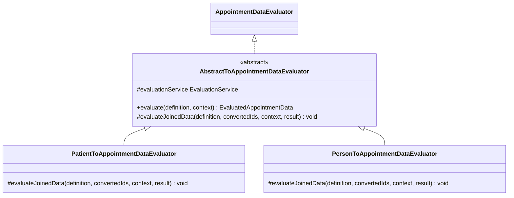

# Abstract Base Class — Duplicate Evaluators

## What changed

`PatientToAppointmentDataEvaluator` and `PersonToAppointmentDataEvaluator` each contained a 70-line `evaluate()` method with ~60 lines of identical code: the same HQL query to build an appointment-to-patient-id map, and the same confidentiality-filter loop. Only the final step differed — how the joined data was loaded and which evaluation context was constructed.

Both classes now extend `AbstractToAppointmentDataEvaluator`, which owns the shared template. Each subclass implements a single protected `evaluateJoinedData` method for its own context and service.

---

## Before

Two independent 70-line methods with identical bodies, differing only in the last ~10 lines:

```java
// PatientToAppointmentDataEvaluator.java
public class PatientToAppointmentDataEvaluator implements AppointmentDataEvaluator {

    @Autowired
    EvaluationService evaluationService;

    @Override
    public EvaluatedAppointmentData evaluate(AppointmentDataDefinition definition, EvaluationContext context)
            throws EvaluationException {
        EvaluatedAppointmentData evaluatedAppointmentData = new EvaluatedAppointmentData(definition, context);

        // --- shared: HQL to build appointment ids -> patient ids ---
        HqlQueryBuilder q = new HqlQueryBuilder();
        q.select("a.appointmentId", "a.patient.patientId");
        q.from(Appointment.class, "a");
        if (context != null) { q.whereIn("a.appointmentId", ...); }
        Map<Integer, Integer> convertedIds = evaluationService.evaluateToMap(...);

        // --- shared: confidentiality filter ---
        if (!Context.hasPrivilege(PRIVILEGE_VIEW_CONFIDENTIAL_APPOINTMENT_DETAILS)) {
            // ... build confidentialMap, iterate and remove confidential entries ...
        }

        if (!convertedIds.keySet().isEmpty()) {
            // Patient-specific: plain EvaluationContext + PatientDataService
            EvaluationContext patientEvaluationContext = new EvaluationContext();
            patientEvaluationContext.setBaseCohort(new Cohort(convertedIds.values()));
            PatientToAppointmentDataDefinition def = (PatientToAppointmentDataDefinition) definition;
            EvaluatedPatientData pd = Context.getService(PatientDataService.class)
                    .evaluate(def.getJoinedDefinition(), patientEvaluationContext);
            for (Integer apptId : convertedIds.keySet()) {
                evaluatedAppointmentData.addData(apptId, pd.getData().get(convertedIds.get(apptId)));
            }
        }
        return evaluatedAppointmentData;
    }
}

// PersonToAppointmentDataEvaluator.java — identical header through the confidentiality filter,
// then diverges only here:
if (!convertedIds.keySet().isEmpty()) {
    // Person-specific: PersonEvaluationContext + PersonIdSet + PersonDataService
    PersonEvaluationContext personEvaluationContext = new PersonEvaluationContext();
    personEvaluationContext.setBaseCohort(new Cohort(convertedIds.values()));
    personEvaluationContext.setBasePersons(new PersonIdSet(new HashSet<>(convertedIds.values())));
    PersonToAppointmentDataDefinition def = (PersonToAppointmentDataDefinition) definition;
    EvaluatedPersonData pd = Context.getService(PersonDataService.class)
            .evaluate(def.getJoinedDefinition(), personEvaluationContext);
    for (Integer apptId : convertedIds.keySet()) {
        evaluatedAppointmentData.addData(apptId, pd.getData().get(convertedIds.get(apptId)));
    }
}
```

---

## After

```java
// AbstractToAppointmentDataEvaluator.java
public abstract class AbstractToAppointmentDataEvaluator implements AppointmentDataEvaluator {

    @Autowired
    protected EvaluationService evaluationService;

    @Override
    public EvaluatedAppointmentData evaluate(AppointmentDataDefinition definition, EvaluationContext context)
            throws EvaluationException {
        EvaluatedAppointmentData result = new EvaluatedAppointmentData(definition, context);

        HqlQueryBuilder q = new HqlQueryBuilder();
        q.select("a.appointmentId", "a.patient.patientId");
        q.from(Appointment.class, "a");
        if (context != null) { q.whereIn("a.appointmentId", ...); }
        Map<Integer, Integer> convertedIds = evaluationService.evaluateToMap(...);

        if (!Context.hasPrivilege(PRIVILEGE_VIEW_CONFIDENTIAL_APPOINTMENT_DETAILS)) {
            // ... confidentiality filter (unchanged) ...
        }

        if (!convertedIds.isEmpty()) {
            evaluateJoinedData(definition, convertedIds, context, result);
        }
        return result;
    }

    protected abstract void evaluateJoinedData(AppointmentDataDefinition definition,
                                               Map<Integer, Integer> convertedIds,
                                               EvaluationContext context,
                                               EvaluatedAppointmentData result) throws EvaluationException;
}

// PatientToAppointmentDataEvaluator.java — only the varying step remains
@Handler(supports = PatientToAppointmentDataDefinition.class, order=50)
public class PatientToAppointmentDataEvaluator extends AbstractToAppointmentDataEvaluator {

    @Override
    protected void evaluateJoinedData(AppointmentDataDefinition definition, Map<Integer, Integer> convertedIds,
                                      EvaluationContext context, EvaluatedAppointmentData result) throws EvaluationException {
        EvaluationContext patientEvaluationContext = new EvaluationContext();
        patientEvaluationContext.setBaseCohort(new Cohort(convertedIds.values()));
        PatientToAppointmentDataDefinition def = (PatientToAppointmentDataDefinition) definition;
        EvaluatedPatientData pd = Context.getService(PatientDataService.class)
                .evaluate(def.getJoinedDefinition(), patientEvaluationContext);
        for (Map.Entry<Integer, Integer> entry : convertedIds.entrySet()) {
            result.addData(entry.getKey(), pd.getData().get(entry.getValue()));
        }
    }
}

// PersonToAppointmentDataEvaluator.java
@Handler(supports = PersonToAppointmentDataDefinition.class, order=50)
public class PersonToAppointmentDataEvaluator extends AbstractToAppointmentDataEvaluator {

    @Override
    protected void evaluateJoinedData(AppointmentDataDefinition definition, Map<Integer, Integer> convertedIds,
                                      EvaluationContext context, EvaluatedAppointmentData result) throws EvaluationException {
        PersonEvaluationContext personEvaluationContext = new PersonEvaluationContext();
        personEvaluationContext.setBaseCohort(new Cohort(convertedIds.values()));
        personEvaluationContext.setBasePersons(new PersonIdSet(new HashSet<Integer>(convertedIds.values())));
        PersonToAppointmentDataDefinition def = (PersonToAppointmentDataDefinition) definition;
        EvaluatedPersonData pd = Context.getService(PersonDataService.class)
                .evaluate(def.getJoinedDefinition(), personEvaluationContext);
        for (Map.Entry<Integer, Integer> entry : convertedIds.entrySet()) {
            result.addData(entry.getKey(), pd.getData().get(entry.getValue()));
        }
    }
}
```

---

## UML — structure after refactor



---

## Why this approach

The two classes share an `evaluate()` algorithm with a single variable step at the end. That is the Template Method pattern: a fixed skeleton in a base class with one abstract hook for the part that differs.

**Alternatives considered and rejected:**

- *Shared helper class (`AppointmentDataEvaluatorHelper`):* The shared logic depends on `evaluationService`, `context`, and the in-progress `convertedIds` map — all of which would need to be passed as parameters. More boilerplate than protected inheritance, and the extraction is purely mechanical with no reuse benefit elsewhere.

- *Default interface methods (Java 8):* An interface cannot hold the `@Autowired EvaluationService` instance field. Every shared method would need `evaluationService` passed as a parameter, which adds more arguments than the abstract class solution removes.

Abstract base class wins because the shared state (`evaluationService`) and the shared algorithm (`evaluate`) belong together, and inheritance expresses that directly without extra parameter plumbing.

---

## Test coverage

Both public entry points are covered by integration tests that run against the real database:

| Test class | Scenarios |
|---|---|
| `PatientToAppointmentDataEvaluatorTest` | Returns patient data for appointments in context; filters confidential appointments; returns empty set for empty input; **returns empty set when all appointments are confidential** |
| `PersonToAppointmentDataEvaluatorTest` | Returns person data for appointments in context; filters confidential appointments; returns empty set for empty input; **returns empty set when all appointments are confidential** |

The last scenario in each was added alongside this refactor: it exercises the `if (!convertedIds.isEmpty())` guard in the base class when the confidentiality filter removes every entry, ensuring `evaluateJoinedData` is not called and an empty result is returned.

`mvn clean install` — **BUILD SUCCESS**, 0 failures, 0 errors.
