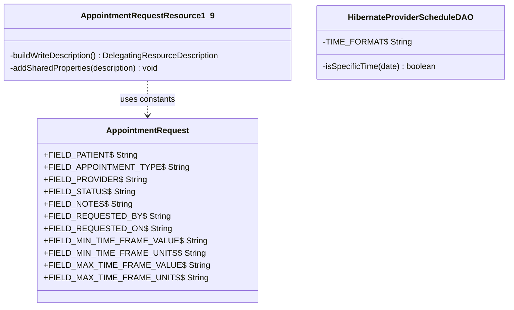

# Constant Extraction — AppointmentRequest & ProviderSchedule

## What changed

The first round of constant extraction (`constant-extraction.md`) covered `Appointment` and `AppointmentBlock`. Two files were left untouched: `AppointmentRequestResource1_9.java` (11 distinct string literals repeated up to 6 times each) and `HibernateProviderScheduleDAO.java` (`"HH:mm:ss"` repeated 4 times). This follow-up resolves those remaining 12 `java:S1192` violations.

Touching these files made pre-existing duplication and a pre-existing S3776 violation visible as "new code" to SonarQube, which would have failed the Quality Gate. Both were fixed as part of the same change.

---

## Before

### AppointmentRequest — no constants

`AppointmentRequestResource1_9` repeated every field name across four methods:

```java
// getRepresentationDescription — DefaultRepresentation
description.addProperty("patient", Representation.DEFAULT);
description.addProperty("appointmentType", Representation.REF);
description.addProperty("provider", Representation.DEFAULT);
description.addProperty("requestedBy", Representation.DEFAULT);
description.addProperty("requestedOn");
description.addProperty("status");
description.addProperty("minTimeFrameValue");
description.addProperty("minTimeFrameUnits");
description.addProperty("maxTimeFrameValue");
description.addProperty("maxTimeFrameUnits");
description.addProperty("notes");
description.addProperty("voided");

// getRepresentationDescription — FullRepresentation (same 8 scalar lines, different Representation args for 4)
// getCreatableProperties (same 11 lines, required/optional distinction differs)
// getUpdatableProperties (identical to getCreatableProperties verbatim)
// doSearch — "patient", "appointmentType", "provider", "status" each appear twice
```

### HibernateProviderScheduleDAO — literal repeated 4 times, nested ifs

```java
if (appointmentDate != null) {
    if (!new SimpleDateFormat("HH:mm:ss").format(appointmentDate).equals("00:00:00")) {
        stringQuery += " AND :appointmentTime >= ...";
    }
}
// ...
if (appointmentDate != null) {
    if (!new SimpleDateFormat("HH:mm:ss").format(appointmentDate).equals("00:00:00")) {
        query.setParameter("appointmentTime", getTimeFromDate(appointmentDate));
    }
}

private Time getTimeFromDate(Date date) {
    return new Time(new SimpleDateFormat("HH:mm:ss")
            .parse(new SimpleDateFormat("HH:mm:ss").format(date)).getTime());
}
```

Cognitive complexity of `getProviderScheduleByConstraints`: **16** (threshold 15). The nested ifs contributed to this, as did the `&&`-merge needed to resolve S1066.

---

## After

### AppointmentRequest.java — 11 constants added

```java
public static final String FIELD_PATIENT              = "patient";
public static final String FIELD_APPOINTMENT_TYPE     = "appointmentType";
public static final String FIELD_PROVIDER             = "provider";
public static final String FIELD_STATUS               = "status";
public static final String FIELD_NOTES                = "notes";
public static final String FIELD_REQUESTED_BY         = "requestedBy";
public static final String FIELD_REQUESTED_ON         = "requestedOn";
public static final String FIELD_MIN_TIME_FRAME_VALUE = "minTimeFrameValue";
public static final String FIELD_MIN_TIME_FRAME_UNITS = "minTimeFrameUnits";
public static final String FIELD_MAX_TIME_FRAME_VALUE = "maxTimeFrameValue";
public static final String FIELD_MAX_TIME_FRAME_UNITS = "maxTimeFrameUnits";
```

### AppointmentRequestResource1_9.java — constants + duplication extracted

The eight scalar properties shared between `DefaultRepresentation` and `FullRepresentation` were extracted to a private helper, and `getCreatableProperties` / `getUpdatableProperties` (which were identical) were merged into a single private method:

```java
@Override
public DelegatingResourceDescription getCreatableProperties() {
    return buildWriteDescription();
}

@Override
public DelegatingResourceDescription getUpdatableProperties() {
    return buildWriteDescription();
}

private DelegatingResourceDescription buildWriteDescription() {
    DelegatingResourceDescription description = new DelegatingResourceDescription();
    description.addRequiredProperty(AppointmentRequest.FIELD_PATIENT);
    description.addRequiredProperty(AppointmentRequest.FIELD_APPOINTMENT_TYPE);
    description.addProperty(AppointmentRequest.FIELD_PROVIDER);
    description.addProperty(AppointmentRequest.FIELD_REQUESTED_BY);
    description.addRequiredProperty(AppointmentRequest.FIELD_REQUESTED_ON);
    description.addRequiredProperty(AppointmentRequest.FIELD_STATUS);
    description.addProperty(AppointmentRequest.FIELD_MIN_TIME_FRAME_VALUE);
    description.addProperty(AppointmentRequest.FIELD_MIN_TIME_FRAME_UNITS);
    description.addProperty(AppointmentRequest.FIELD_MAX_TIME_FRAME_VALUE);
    description.addProperty(AppointmentRequest.FIELD_MAX_TIME_FRAME_UNITS);
    description.addProperty(AppointmentRequest.FIELD_NOTES);
    return description;
}

private void addSharedProperties(DelegatingResourceDescription description) {
    description.addProperty(AppointmentRequest.FIELD_REQUESTED_ON);
    description.addProperty(AppointmentRequest.FIELD_STATUS);
    description.addProperty(AppointmentRequest.FIELD_MIN_TIME_FRAME_VALUE);
    description.addProperty(AppointmentRequest.FIELD_MIN_TIME_FRAME_UNITS);
    description.addProperty(AppointmentRequest.FIELD_MAX_TIME_FRAME_VALUE);
    description.addProperty(AppointmentRequest.FIELD_MAX_TIME_FRAME_UNITS);
    description.addProperty(AppointmentRequest.FIELD_NOTES);
    description.addProperty("voided");
}
```

The representation methods now call `addSharedProperties(description)` instead of repeating those 8 lines.

### HibernateProviderScheduleDAO.java — constant + complexity fix

```java
private static final String TIME_FORMAT = "HH:mm:ss";

private boolean isSpecificTime(Date date) {
    return date != null && !new SimpleDateFormat(TIME_FORMAT).format(date).equals("00:00:00");
}
```

The two nested if blocks became single-condition checks:

```java
if (isSpecificTime(appointmentDate)) {
    stringQuery += " AND :appointmentTime >= providerSchedule.startTime ...";
}
// ...
if (isSpecificTime(appointmentDate)) {
    query.setParameter("appointmentTime", getTimeFromDate(appointmentDate));
}
```

`getTimeFromDate` uses `TIME_FORMAT` instead of the four raw literals. Cognitive complexity of `getProviderScheduleByConstraints` dropped from **16 to 14**.

---

## UML — ownership after refactor



---

## Why `buildWriteDescription` and `addSharedProperties`

When all string literals were replaced with constants, SonarQube flagged **31.4% duplication on new code** (Quality Gate requires ≤ 3%). The duplication came from two sources:

1. `getCreatableProperties` and `getUpdatableProperties` had identical bodies (11 lines each) — resolved by `buildWriteDescription`.
2. The eight scalar property lines (`requestedOn`, `status`, time frame fields, `notes`, `voided`) were identical in both the Default and Full representation blocks — resolved by `addSharedProperties`.

These extractions are not new design decisions — the duplication existed before the constant extraction. Making the lines uniform (replacing literals with constants) simply made the pattern visible to SonarQube as new code, which forced it to be addressed.

---

## Test coverage

No behavior changed. The `addProperty` calls produce the same string values as before — only via named constants rather than raw literals. The existing representation tests verify the output:

| Test class | What it exercises |
|---|---|
| `AppointmentRequestResource1_9Test` | `validateDefaultRepresentation`, `validateFullRepresentation` — asserts all properties present in JSON payload |
| `AppointmentRequestResource1_9ControllerTest` | End-to-end: POST creates a request, GET retrieves it with all fields |

`mvn clean package` — **BUILD SUCCESS**, 0 failures, 0 errors.
