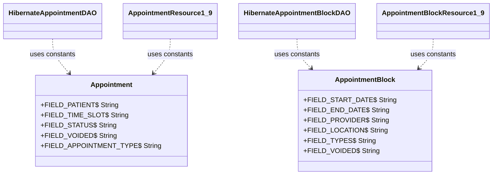

# Constant Extraction — Field Name Literals

## What changed

`Appointment` and `AppointmentBlock` each had their Hibernate field names written as raw string literals scattered across two DAO classes and two REST resource classes. SonarQube flagged 49 instances of `java:S1192` (string literal repeated 3+ times without a constant).

Each domain class now owns its field name constants. The DAOs and REST resources reference those constants instead of repeating the strings.

---

## Before

Raw string literals repeated across `HibernateAppointmentDAO`, `HibernateAppointmentBlockDAO`, `AppointmentResource1_9`, and `AppointmentBlockResource1_9`:

```java
// HibernateAppointmentDAO.java
criteria.add(Restrictions.eq("patient", patient));
criteria.add(Restrictions.eq("status", SCHEDULED));
criteria.add(Restrictions.eq("voided", false));
criteria.createAlias("timeSlot", "timeSlot");
criteria.add(Restrictions.in("appointmentType", appointmentTypes));

// HibernateAppointmentBlockDAO.java
criteria.add(Restrictions.ge("startDate", fromDate));
criteria.add(Restrictions.le("endDate", toDate));
criteria.add(Restrictions.eq("provider", appointmentBlock.getProvider()));
criteria.createAlias("types", "appointmentType");

// AppointmentResource1_9.java
description.addProperty("timeSlot", Representation.DEFAULT);
description.addProperty("patient", Representation.DEFAULT);
description.addRequiredProperty("status");
```

---

## After

Constants defined once in the domain classes:

```java
// Appointment.java
public static final String FIELD_PATIENT          = "patient";
public static final String FIELD_TIME_SLOT        = "timeSlot";
public static final String FIELD_STATUS           = "status";
public static final String FIELD_VOIDED           = "voided";
public static final String FIELD_APPOINTMENT_TYPE = "appointmentType";

// AppointmentBlock.java
public static final String FIELD_START_DATE = "startDate";
public static final String FIELD_END_DATE   = "endDate";
public static final String FIELD_PROVIDER   = "provider";
public static final String FIELD_LOCATION   = "location";
public static final String FIELD_TYPES      = "types";
public static final String FIELD_VOIDED     = "voided";
```

Referenced everywhere else:

```java
// HibernateAppointmentDAO.java
criteria.add(Restrictions.eq(Appointment.FIELD_PATIENT, patient));
criteria.add(Restrictions.eq(Appointment.FIELD_STATUS, SCHEDULED));
criteria.add(Restrictions.eq(Appointment.FIELD_VOIDED, false));
criteria.createAlias(Appointment.FIELD_TIME_SLOT, "timeSlot");

// AppointmentResource1_9.java
description.addProperty(Appointment.FIELD_TIME_SLOT, Representation.DEFAULT);
description.addProperty(Appointment.FIELD_PATIENT, Representation.DEFAULT);
description.addRequiredProperty(Appointment.FIELD_STATUS);
```

---

## UML — ownership after refactor



---

## Test coverage

No behavior changed — the constants compile to the same string values. The existing regression suite verifies correctness:

| Test class | What it exercises |
|---|---|
| `AppointmentServiceTest` | `getAppointmentsByConstraints` (10 scenarios covering patient, status, provider, appointmentType, date range), `getScheduledAppointmentsForPatient`, `getAppointmentsInTimeSlot` |
| `AppointmentBlockServiceTest` | `getAppointmentBlocks` (8 scenarios covering location, provider, date, appointmentType), `getOverlappingAppointmentBlocks` |
| `AppointmentResource1_9Test` | `validateDefaultRepresentation`, `validateFullRepresentation` — asserts patient, status, appointmentType, voided present in JSON payload |
| `AppointmentBlockResource1_9Test` | Same representation validation for startDate, endDate, provider, location, types, voided |

`mvn clean install` — **BUILD SUCCESS**, 132 tests, 0 failures, 0 errors.
