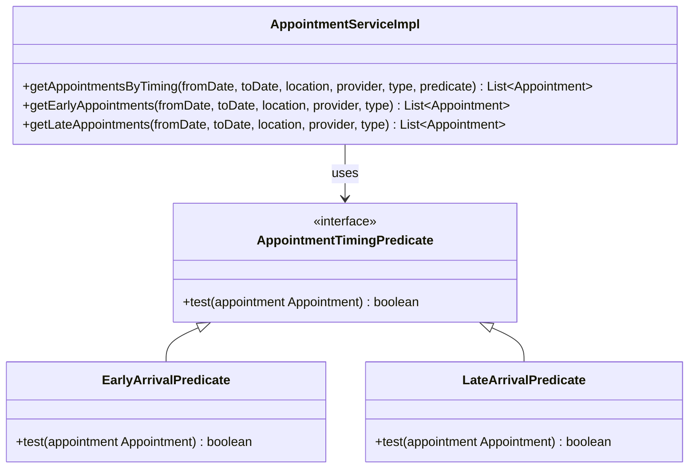

# Strategy Pattern — Appointment Timing Predicate

## What changed

`getEarlyAppointments` en `getLateAppointments` in `AppointmentServiceImpl` bevatten identieke logica: dezelfde statuslijst opbouwen, dezelfde `getAppointmentsByConstraints`-aanroep doen, en daarna elk een eigen filterconditie uitvoeren. De twee methoden verschilden alleen in de `if`-conditie waarmee appointments werden geselecteerd.

Er is nu een `AppointmentTimingPredicate`-interface geïntroduceerd met twee implementaties: `EarlyArrivalPredicate` en `LateArrivalPredicate`. De gedeelde logica is samengebracht in `getAppointmentsByTiming`, dat de predicate als parameter ontvangt. Beide publieke methoden delegeren daar nu naartoe.

---

## Before

Twee methoden met identieke opzet, alleen de filterconditie verschilde:

```java
// AppointmentServiceImpl.java
@Override
public List<Appointment> getEarlyAppointments(Date fromDate, Date toDate, Location location,
                                              Provider provider, AppointmentType appointmentType) throws APIException {
    List<AppointmentStatus> statuses = new ArrayList<AppointmentStatus>();
    statuses.add(AppointmentStatus.COMPLETED);
    statuses.add(AppointmentStatus.INCONSULTATION);

    List<Appointment> allCompletedAppointments = getAppointmentsByConstraints(fromDate,
            toDate, location, provider, appointmentType, null, statuses);

    List<Appointment> earlyAppointments = new ArrayList<Appointment>();
    for (Appointment ap : allCompletedAppointments) {
        if (ap.getVisit().getStartDatetime().before(ap.getTimeSlot().getEndDate())) {
            earlyAppointments.add(ap);
        }
    }
    return earlyAppointments;
}

@Override
public List<Appointment> getLateAppointments(Date fromDate, Date toDate, Location location,
                                             Provider provider, AppointmentType appointmentType) throws APIException {
    List<AppointmentStatus> statuses = new ArrayList<AppointmentStatus>();
    statuses.add(AppointmentStatus.COMPLETED);
    statuses.add(AppointmentStatus.INCONSULTATION);

    List<Appointment> allCompletedAppointments = getAppointmentsByConstraints(fromDate,
            toDate, location, provider, appointmentType, null, statuses);

    List<Appointment> lateAppointments = new ArrayList<Appointment>();
    for (Appointment ap : allCompletedAppointments) {
        if (ap.getVisit().getStartDatetime().after(ap.getTimeSlot().getEndDate())) {
            lateAppointments.add(ap);
        }
    }
    return lateAppointments;
}
```

---

## After

```java
// AppointmentTimingPredicate.java
public interface AppointmentTimingPredicate {
    boolean test(Appointment appointment);
}

// EarlyArrivalPredicate.java
public class EarlyArrivalPredicate implements AppointmentTimingPredicate {
    @Override
    public boolean test(Appointment appointment) {
        return appointment.getVisit().getStartDatetime().before(appointment.getTimeSlot().getEndDate());
    }
}

// LateArrivalPredicate.java
public class LateArrivalPredicate implements AppointmentTimingPredicate {
    @Override
    public boolean test(Appointment appointment) {
        return appointment.getVisit().getStartDatetime().after(appointment.getTimeSlot().getEndDate());
    }
}

// AppointmentServiceImpl.java
public List<Appointment> getAppointmentsByTiming(Date fromDate, Date toDate, Location location,
                                                  Provider provider, AppointmentType appointmentType,
                                                  AppointmentTimingPredicate predicate) throws APIException {
    List<AppointmentStatus> statuses = new ArrayList<AppointmentStatus>();
    statuses.add(AppointmentStatus.COMPLETED);
    statuses.add(AppointmentStatus.INCONSULTATION);

    List<Appointment> allCompletedAppointments = getAppointmentsByConstraints(fromDate,
            toDate, location, provider, appointmentType, null, statuses);

    List<Appointment> result = new ArrayList<Appointment>();
    for (Appointment ap : allCompletedAppointments) {
        if (predicate.test(ap)) {
            result.add(ap);
        }
    }
    return result;
}

@Override
public List<Appointment> getEarlyAppointments(Date fromDate, Date toDate, Location location,
                                              Provider provider, AppointmentType appointmentType) throws APIException {
    return getAppointmentsByTiming(fromDate, toDate, location, provider, appointmentType, new EarlyArrivalPredicate());
}

@Override
public List<Appointment> getLateAppointments(Date fromDate, Date toDate, Location location,
                                             Provider provider, AppointmentType appointmentType) throws APIException {
    return getAppointmentsByTiming(fromDate, toDate, location, provider, appointmentType, new LateArrivalPredicate());
}
```

---

## UML — structuur na refactor



---

## Why this approach

De twee methoden deelden een identiek algoritme met één variabele stap: de filterconditie. Dat is het Strategy-patroon — het wisselende gedrag (de predicate) is geïsoleerd achter een interface, zodat het algoritme zelf maar één keer geschreven hoeft te worden.

**Alternatieven overwogen en afgewezen:**

- *Boolean-parameter (`boolean early`):* `getAppointmentsByTiming(..., true)` versus `false` — de betekenis van de boolean is niet leesbaar op de aanroepsite en legt de twee gevallen vast als voor altijd de enige. Een predicate is uitbreidbaar zonder de handtekening te wijzigen.

- *Template Method (abstracte basisklasse):* Zou een nieuwe abstracte klasse vereisen die `AppointmentService` implementeert, terwijl `AppointmentServiceImpl` al een concrete klasse is. Meer structuurwijziging voor hetzelfde resultaat; Strategy via een losse interface is hier eenvoudiger.

Strategy wint omdat de variatie beperkt is tot één expressie, de predicate volledig vervangbaar is zonder de aanroeper te wijzigen, en `getAppointmentsByTiming` zelf bruikbaar blijft voor eventuele toekomstige timingcriteria.

---

## Test coverage

| Testmethode | Wat het verifieert |
|---|---|
| `getEarlyAppointments_shouldGetEarlyAppointments` | Retourneert 1 early appointment in de opgegeven datumrange |
| `getLateAppointments_shoulGetLateAppointments` | Retourneert 1 late appointment in de opgegeven datumrange |
| `getEarlyAppointments_shouldReturnEmptyListWhenNoAppointmentsInRange` | Lege lijst wanneer er geen completed appointments in de range zijn |
| `getLateAppointments_shouldReturnEmptyListWhenNoAppointmentsInRange` | Lege lijst wanneer er geen completed appointments in de range zijn |
| `getEarlyAppointments_shouldReturnEmptyListWhenTypeFilterExcludesAll` | Lege lijst wanneer het type-filter alle appointments uitsluit |
| `getLateAppointments_shouldReturnEmptyListWhenTypeFilterExcludesAll` | Lege lijst wanneer het type-filter alle appointments uitsluit |
| `getEarlyAndLateAppointments_shouldExcludeOnTimeAppointment` | Een appointment waarvan `visit.startDatetime == timeSlot.endDate` verschijnt in geen van beide lijsten |

`mvn test -pl api` — **BUILD SUCCESS**, 6 tests, 0 failures, 0 errors.
