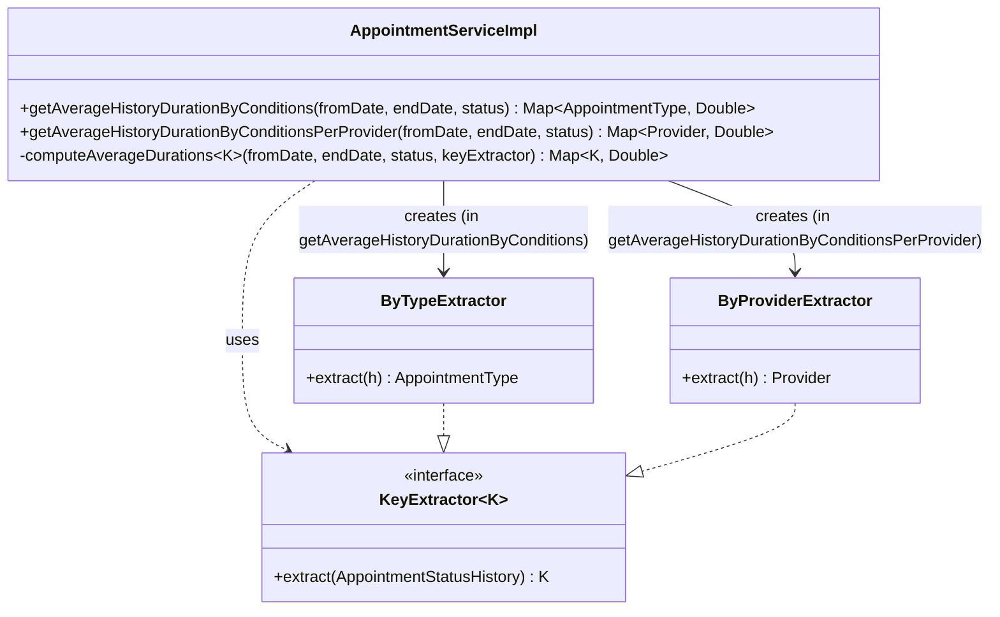

# Template Method Refactor — `computeAverageDurations`

## What changed

`AppointmentServiceImpl` contained two near-identical 65-line methods:

- `getAverageHistoryDurationByConditions` — groups average wait times by `AppointmentType`
- `getAverageHistoryDurationByConditionsPerProvider` — groups the same calculation by `Provider`

The algorithm was identical in both: fetch histories, filter unreasonable durations, build a confidence interval, sum durations per key, divide to get the average. The only difference was a single line — how the grouping key was extracted from each history entry.

Both public methods are now one-liners. The shared logic lives in a single private `computeAverageDurations` method that accepts a `KeyExtractor<K>` to capture the varying step.

---

## Before

Two independent 65-line methods with duplicated algorithm bodies:

```java
public Map<AppointmentType, Double> getAverageHistoryDurationByConditions(
        Date fromDate, Date endDate, AppointmentStatus status) {
    // ... 65 lines of: fetch, filter, confidence interval, accumulate, average
    AppointmentType type = entry.getKey().getAppointment().getAppointmentType(); // <- the only varying line
    // ...
}

public Map<Provider, Double> getAverageHistoryDurationByConditionsPerProvider(
        Date fromDate, Date endDate, AppointmentStatus status) {
    // ... same 65 lines verbatim
    Provider provider = entry.getKey().getAppointment().getTimeSlot()
            .getAppointmentBlock().getProvider();                                // <- the only varying line
    // ...
}
```

---

## After

```java
private interface KeyExtractor<K> {
    K extract(AppointmentStatusHistory history);
}

public Map<AppointmentType, Double> getAverageHistoryDurationByConditions(
        Date fromDate, Date endDate, AppointmentStatus status) {
    return computeAverageDurations(fromDate, endDate, status,
            new KeyExtractor<AppointmentType>() {
                @Override
                public AppointmentType extract(AppointmentStatusHistory h) {
                    return h.getAppointment().getAppointmentType();
                }
            });
}

public Map<Provider, Double> getAverageHistoryDurationByConditionsPerProvider(
        Date fromDate, Date endDate, AppointmentStatus status) {
    return computeAverageDurations(fromDate, endDate, status,
            new KeyExtractor<Provider>() {
                @Override
                public Provider extract(AppointmentStatusHistory h) {
                    return h.getAppointment().getTimeSlot().getAppointmentBlock().getProvider();
                }
            });
}

private <K> Map<K, Double> computeAverageDurations(
        Date fromDate, Date endDate, AppointmentStatus status,
        KeyExtractor<K> keyExtractor) {
    // single implementation of: fetch, filter, confidence interval, accumulate, average
    K key = keyExtractor.extract(entry.getKey()); // only call site of the varying step
    // ...
}
```

---

## UML — structure after refactor



---

## Why not `java.util.function.Function` with lambdas

The original proposal used `Function<AppointmentStatusHistory, K>` from `java.util.function` and lambda syntax. This was rejected for a runtime compatibility reason:

OpenMRS 1.9.9 bundles Spring 3.x, which uses ASM 4.x for classpath scanning. ASM 4.x cannot parse `invokedynamic` bytecode — the instruction Java 8 generates for lambda expressions. Using lambda syntax caused Spring to fail loading `AppointmentServiceImpl.class` with `ArrayIndexOutOfBoundsException: 60161` at test startup, breaking 175 tests across the module.

The existing codebase already works around this constraint: two anonymous inner classes at lines 913 and 930 carry an unfixed Sonar `S1604` warning ("Make this anonymous inner class a lambda") for the same reason.

Using a local `KeyExtractor<K>` interface with anonymous inner classes produces equivalent structure without `invokedynamic` entries in the class file, which ASM 4.x can parse successfully.

---

## Minor behavioral alignment

The two original methods had a subtle inconsistency in the duration filter:

| Method | Filter |
|---|---|
| `getAverageHistoryDurationByConditions` | `duration < minutesInADay` |
| `getAverageHistoryDurationByConditionsPerProvider` | `duration > 0 && duration < minutesInADay` |

The unified method uses `duration > 0 && duration < minutesInADay` (the stricter check from the `PerProvider` version). Zero-duration entries are meaningless to average and the `> 0` guard is clearly correct. The existing tests pass with this alignment.

---

## Test coverage

Both public methods are covered in `AppointmentStatusHistoryServiceTest`:

- `getAverageHistoryDurationByConditions_shouldRetrieveCorrectly` — 3 scenarios (WAITING, INCONSULTATION, SCHEDULED/empty)
- `getAverageHistoryDurationByConditionsPerProvider_shouldRetrieveCorrectly` — same 3 scenarios keyed by `Provider`

`mvn clean install` passes: `BUILD SUCCESS`, 0 failures, 0 errors.
